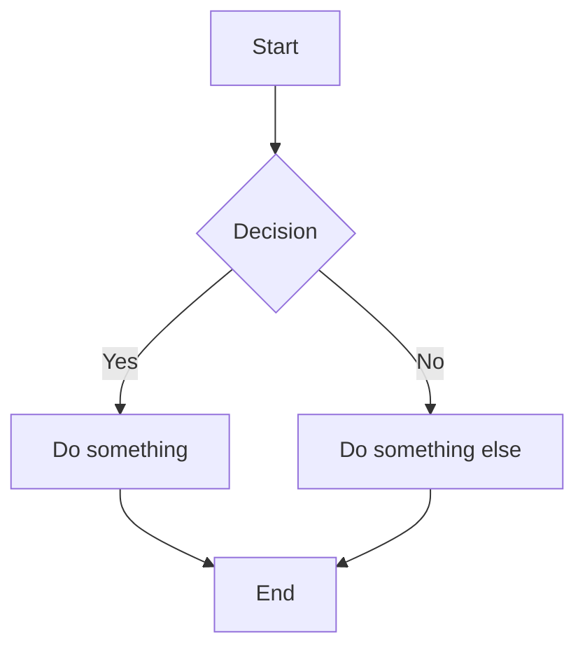
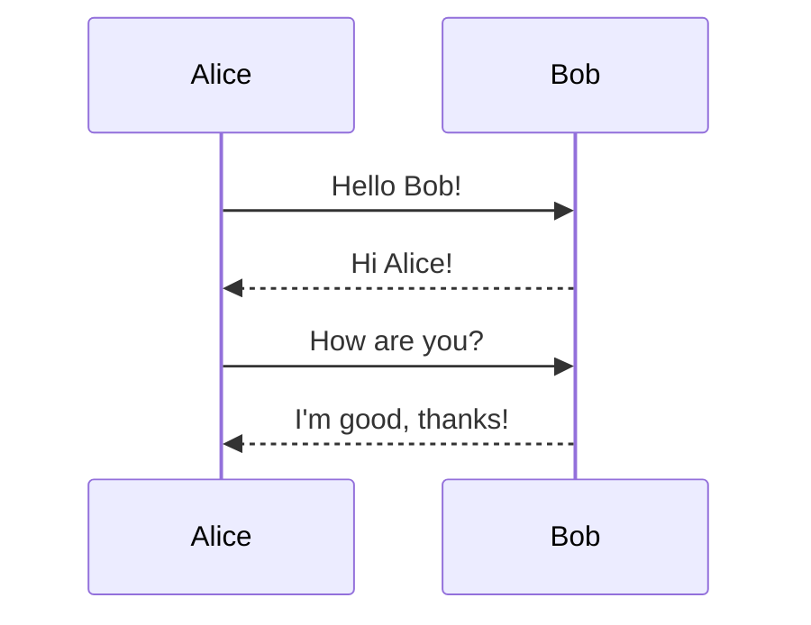
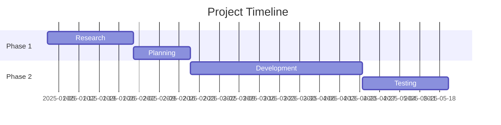
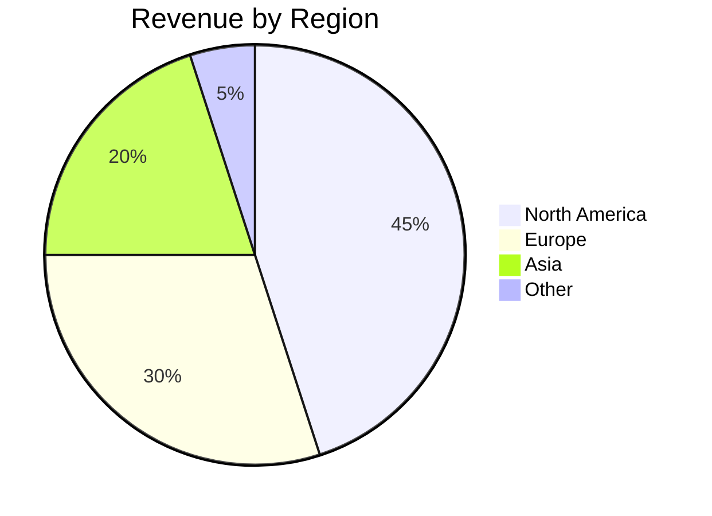

# The Complete Guide to Markdown

> From absolute beginner to power user — everything you need to write and format Markdown like a pro.

---

## Table of Contents

1. [What is Markdown?](#what-is-markdown)
2. [Headings](#headings)
3. [Text Formatting](#text-formatting)
4. [Paragraphs and Line Breaks](#paragraphs-and-line-breaks)
5. [Lists](#lists)
6. [Links](#links)
7. [Images](#images)
8. [Blockquotes](#blockquotes)
9. [Code](#code)
10. [Horizontal Rules](#horizontal-rules)
11. [Tables](#tables)
12. [Task Lists](#task-lists)
13. [Footnotes](#footnotes)
14. [Definition Lists](#definition-lists)
15. [Emoji](#emoji)
16. [HTML in Markdown](#html-in-markdown)
17. [Escaping Characters](#escaping-characters)
18. [Advanced Techniques](#advanced-techniques)
19. [Mermaid Diagrams](#mermaid-diagrams)
20. [Math Expressions](#math-expressions)
21. [Platform-Specific Features](#platform-specific-features)
22. [Best Practices](#best-practices)

---

## What is Markdown?

Markdown is a lightweight markup language created by John Gruber in 2004. It lets you write formatted text using plain text syntax. Markdown files use the `.md` or `.markdown` extension and are widely used in documentation, README files, blogs, forums, and note-taking apps.

**Why use Markdown?**

- It's readable even as raw text
- It's platform-independent
- It converts easily to HTML, PDF, and other formats
- It's the standard for GitHub, GitLab, Stack Overflow, Reddit, and countless other platforms

---

## Headings

Headings use the `#` symbol. The number of `#` symbols determines the heading level (1–6).

**Syntax:**

```markdown
# Heading 1
## Heading 2
### Heading 3
#### Heading 4
##### Heading 5
###### Heading 6
```

**Rules:**

- Always put a space between the `#` and the heading text.
- Leave a blank line before and after a heading for compatibility.
- There is no Heading 7 — `#######` won't render as a heading.

**Alternate syntax (for H1 and H2 only):**

```markdown
Heading 1
=========

Heading 2
---------
```

This underline-style syntax works but is less common and less flexible.

---

## Text Formatting

### Bold

Wrap text with double asterisks or double underscores.

```markdown
**This is bold**
__This is also bold__
```

**Result:** **This is bold**

### Italic

Wrap text with single asterisks or single underscores.

```markdown
*This is italic*
_This is also italic_
```

**Result:** *This is italic*

### Bold and Italic

Combine them with triple asterisks or triple underscores.

```markdown
***Bold and italic***
___Bold and italic___
**_Bold and italic_**
*__Bold and italic__*
```

**Result:** ***Bold and italic***

### Strikethrough

Wrap text with double tildes.

```markdown
~~This text is crossed out~~
```

**Result:** ~~This text is crossed out~~

### Highlight (Extended Syntax)

Some processors support highlighting with double equals signs.

```markdown
==This is highlighted==
```

### Subscript and Superscript (Extended Syntax)

```markdown
H~2~O        → subscript
X^2^         → superscript
```

> Note: Subscript and superscript are not part of standard Markdown. They work in some processors like Pandoc and certain note-taking apps.

---

## Paragraphs and Line Breaks

### Paragraphs

Separate paragraphs with a blank line.

```markdown
This is the first paragraph.

This is the second paragraph.
```

### Line Breaks

To create a line break without starting a new paragraph, end a line with **two or more spaces** then press Enter. Alternatively, use the `<br>` HTML tag.

```markdown
This is line one.  
This is line two.

Or use HTML:<br>
This forces a break.
```

> **Tip:** Trailing spaces are invisible, which is why many writers prefer using `<br>` for clarity.

---

## Lists

### Unordered Lists

Use `-`, `*`, or `+` followed by a space.

```markdown
- Item one
- Item two
- Item three
```

**All three markers produce the same result.** Pick one and be consistent.

### Ordered Lists

Use numbers followed by a period and a space.

```markdown
1. First item
2. Second item
3. Third item
```

The actual numbers don't matter — Markdown auto-numbers. This also works:

```markdown
1. First item
1. Second item
1. Third item
```

### Nested Lists

Indent with 2 or 4 spaces (be consistent).

```markdown
- Fruits
  - Apple
  - Banana
    - Cavendish
    - Plantain
- Vegetables
  - Carrot
```

### Mixed Lists

You can nest ordered lists inside unordered lists and vice versa.

```markdown
1. First step
   - Sub-detail A
   - Sub-detail B
2. Second step
   1. Sub-step 2.1
   2. Sub-step 2.2
```

### Adding Content to List Items

You can add paragraphs, blockquotes, code blocks, and images inside list items by indenting them.

```markdown
1. Open the file.

   Make sure the file exists before opening it.

2. Read the contents.

   > This is a blockquote inside a list item.

3. Close the file.

   ```python
   file.close()
   ```
```

---

## Links

### Inline Links

```markdown
[Link text](https://example.com)
[Link with title](https://example.com "Hover text here")
```

**Result:** [Link text](https://example.com)

### Reference Links

Useful when you reuse the same URL multiple times.

```markdown
Here is [an article][1] and [another one][2].

[1]: https://example.com/article-one "Article One"
[2]: https://example.com/article-two "Article Two"
```

### Autolinks

Wrap a URL or email in angle brackets.

```markdown
<https://example.com>
<user@example.com>
```

Many processors also auto-link raw URLs: `https://example.com`

### Section Links (Anchors)

Link to a heading within the same document.

```markdown
[Go to Tables](#tables)
```

**Rules for anchor links:**

- Convert the heading text to lowercase
- Replace spaces with hyphens
- Remove punctuation (except hyphens)
- Example: `## My Cool Section!` → `#my-cool-section`

---

## Images

### Basic Image

```markdown

```

### Image with Title

```markdown

```

### Image as Link

Wrap the image syntax in link syntax.

```markdown
[](https://example.com)
```

### Image with Reference

```markdown
![Alt text][logo]

[logo]: https://example.com/logo.png "Company Logo"
```

### Resizing Images (HTML fallback)

Standard Markdown has no size controls. Use HTML instead.

```html

```

---

## Blockquotes

Use `>` at the start of a line.

```markdown
> This is a blockquote.
```

### Multi-line Blockquotes

```markdown
> This is the first line.
> This is the second line.
```

### Nested Blockquotes

```markdown
> Outer quote
>
>> Nested quote
>>
>>> Deeply nested quote
```

### Blockquotes with Other Elements

```markdown
> ### A heading inside a blockquote
>
> - List item one
> - List item two
>
> **Bold** text and *italic* text work too.
```

---

## Code

### Inline Code

Wrap text with single backticks.

```markdown
Use the `print()` function.
```

**Result:** Use the `print()` function.

### Backticks Inside Inline Code

Use double backticks to wrap code that contains a backtick.

```markdown
``There is a ` backtick inside this.``
```

### Fenced Code Blocks

Wrap code with triple backticks. Optionally add a language identifier for syntax highlighting.

````markdown
```python
def greet(name):
    return f"Hello, {name}!"
```
````

### Common Language Identifiers

| Language   | Identifier     |
|------------|----------------|
| Python     | `python`       |
| JavaScript | `javascript` or `js` |
| TypeScript | `typescript` or `ts` |
| HTML       | `html`         |
| CSS        | `css`          |
| SQL        | `sql`          |
| Bash       | `bash` or `sh` |
| JSON       | `json`         |
| YAML       | `yaml`         |
| Markdown   | `markdown`     |
| C          | `c`            |
| C++        | `cpp`          |
| Java       | `java`         |
| Rust       | `rust`         |
| Go         | `go`           |
| Ruby       | `ruby`         |
| R          | `r`            |

### Indented Code Blocks

Indent every line by 4 spaces or 1 tab (less common, fenced blocks preferred).

```markdown
    function hello() {
        console.log("Hello");
    }
```

### Showing Triple Backticks in Code

Use four backticks to wrap a code block that itself contains triple backticks.

`````markdown
````markdown
```python
print("Hello")
```
````
`````

---

## Horizontal Rules

Use three or more hyphens, asterisks, or underscores on a line by themselves.

```markdown
---
***
___
```

All three produce the same result: a horizontal divider.

---

## Tables

### Basic Table

```markdown
| Name     | Age | City     |
|----------|-----|----------|
| Alice    | 30  | London   |
| Bob      | 25  | Lagos    |
| Charlie  | 35  | New York |
```

**Result:**

| Name     | Age | City     |
|----------|-----|----------|
| Alice    | 30  | London   |
| Bob      | 25  | Lagos    |
| Charlie  | 35  | New York |

### Column Alignment

Control alignment using colons in the separator row.

```markdown
| Left-aligned | Center-aligned | Right-aligned |
|:-------------|:--------------:|--------------:|
| Left         |    Center      |         Right |
| Text         |    Text        |          Text |
```

| Left-aligned | Center-aligned | Right-aligned |
|:-------------|:--------------:|--------------:|
| Left         |    Center      |         Right |
| Text         |    Text        |          Text |

### Formatting Inside Tables

You can use inline formatting inside table cells.

```markdown
| Feature      | Status             |
|--------------|--------------------|
| **Bold**     | ~~Deprecated~~     |
| `code`       | *italic*           |
| [Link](#)    | Normal text        |
```

> **Limitations:** Tables cannot contain block-level elements like headings, lists, or code blocks. For complex tables, fall back to HTML.

---

## Task Lists

Task lists (checkboxes) are an extended syntax supported by GitHub and most modern Markdown editors.

```markdown
- [x] Write the introduction
- [x] Add code examples
- [ ] Proofread the document
- [ ] Publish
```

**Result:**

- [x] Write the introduction
- [x] Add code examples
- [ ] Proofread the document
- [ ] Publish

---

## Footnotes

Footnotes are an extended syntax. They work in GitHub, Pandoc, and many static site generators.

```markdown
Here is a statement that needs a source.[^1]

And another claim.[^note]

[^1]: This is the footnote text.
[^note]: Footnotes can have any label, not just numbers.
```

Footnotes are rendered at the bottom of the document automatically.

---

## Definition Lists

Supported by some processors (Pandoc, PHP Markdown Extra).

```markdown
Markdown
: A lightweight markup language.

HTML
: The standard markup language for web pages.
```

---

## Emoji

### Shortcodes (GitHub, Slack, many editors)

```markdown
:smile: :rocket: :thumbsup: :fire: :star:
```

### Direct Unicode

You can paste emoji directly into Markdown.

```markdown
That's amazing! 🚀🔥
```

> **Tip:** A full list of GitHub emoji shortcodes is available at [github.com/ikatyang/emoji-cheat-sheet](https://github.com/ikatyang/emoji-cheat-sheet).

---

## HTML in Markdown

You can use raw HTML anywhere in a Markdown document. This is useful for features Markdown doesn't natively support.

### Common Use Cases

**Collapsible sections:**

```html
<details>
<summary>Click to expand</summary>

Hidden content goes here. You can use **Markdown** inside.

</details>
```

**Centering text:**

```html
<div align="center">

# Centered Heading

This paragraph is centered.

</div>
```

**Colored text (limited support):**

```html
<span style="color: red;">Red text</span>
```

> Note: Many platforms (including GitHub) strip `style` attributes for security. Use this only where you control the renderer.

**Keyboard keys:**

```html
Press <kbd>Ctrl</kbd> + <kbd>C</kbd> to copy.
```

**Result:** Press <kbd>Ctrl</kbd> + <kbd>C</kbd> to copy.

---

## Escaping Characters

Use a backslash `\` to display characters that would otherwise be interpreted as Markdown syntax.

```markdown
\*Not italic\*
\# Not a heading
\- Not a list
\[Not a link\]
```

**Characters you can escape:**

```
\   backslash
`   backtick
*   asterisk
_   underscore
{}  curly braces
[]  square brackets
()  parentheses
#   hash
+   plus
-   minus/hyphen
.   dot
!   exclamation
|   pipe
~   tilde
```

---

## Advanced Techniques

### Linking to Files in a Repository

```markdown
See the [contributing guide](docs/CONTRIBUTING.md) for details.
Check the [source code](src/main.py).
```

### Relative Image Paths

```markdown

```

### Badges (Common in README files)

```markdown


```

### Table of Contents (Manual)

```markdown
## Table of Contents

- [Introduction](#introduction)
- [Installation](#installation)
- [Usage](#usage)
- [API Reference](#api-reference)
- [Contributing](#contributing)
```

### Comments (Hidden Text)

```markdown
[//]: # (This is a comment and won't be rendered)

<!-- This HTML comment also works -->
```

### Multi-line Content in Tables (HTML Workaround)

```html
<table>
  <tr>
    <td>

**Bold Markdown** works inside HTML tables.

- Even lists
- Work here

</td>
    <td>Second column content</td>
  </tr>
</table>
```

### Linking Headings with Custom Anchors (Extended)

Some processors support custom anchor IDs:

```markdown
## My Custom Section {#custom-id}

[Jump to custom section](#custom-id)
```

---

## Mermaid Diagrams

Mermaid is a diagramming syntax supported by GitHub, GitLab, Notion, Obsidian, and other platforms.

### Flowchart

````markdown

````

### Sequence Diagram

````markdown

````

### Gantt Chart

````markdown

````

### Pie Chart

````markdown

````

---

## Math Expressions

Many platforms (GitHub, GitLab, Jupyter, Obsidian) support LaTeX math using dollar signs.

### Inline Math

```markdown
The equation $E = mc^2$ changed physics forever.
```

### Block Math

```markdown
$$
\frac{-b \pm \sqrt{b^2 - 4ac}}{2a}
$$
```

### Common Math Symbols

| Symbol            | LaTeX Code              |
|-------------------|-------------------------|
| Fraction          | `\frac{a}{b}`           |
| Square root       | `\sqrt{x}`              |
| Summation         | `\sum_{i=1}^{n} x_i`   |
| Integral          | `\int_0^1 f(x)\,dx`    |
| Greek letters     | `\alpha, \beta, \gamma` |
| Subscript         | `x_{n}`                 |
| Superscript       | `x^{n}`                 |
| Infinity          | `\infty`                |
| Not equal         | `\neq`                  |
| Less/greater or equal | `\leq, \geq`       |
| Arrow             | `\rightarrow`           |

---

## Platform-Specific Features

### GitHub Flavored Markdown (GFM)

- Task lists with `- [x]` and `- [ ]`
- Tables
- Strikethrough with `~~`
- Autolinked URLs
- Emoji shortcodes
- Mermaid diagrams in code blocks
- Math expressions with `$` and `$$`
- Alerts/admonitions:

```markdown
> [!NOTE]
> Useful information.

> [!TIP]
> Helpful advice.

> [!IMPORTANT]
> Key information.

> [!WARNING]
> Something to be careful about.

> [!CAUTION]
> Potential negative consequences.
```

### Obsidian

- Wikilinks: `[[Page Name]]`
- Embeds: `![[Note or Image]]`
- Callouts: `> [!info]` blocks
- Tags: `#tag`
- Internal links with aliases: `[[Page Name|Display Text]]`

### Notion

- Toggle blocks
- Database links
- Callout blocks
- Synced blocks

### Pandoc

- Citations: `[@source2024]`
- Definition lists
- Custom attributes
- YAML front matter for metadata
- Conversion between dozens of formats

---

## Best Practices

### Writing Quality

1. **Use headings hierarchically.** Don't skip levels — go from `##` to `###`, not from `##` to `####`.
2. **Keep lines readable.** Many style guides recommend wrapping at 80–120 characters, but most modern editors soft-wrap, so this is optional.
3. **Be consistent.** Pick one style for unordered lists (`-` vs `*`), bold (`**` vs `__`), and stick with it.
4. **Use blank lines generously.** Separate headings, paragraphs, lists, and code blocks with blank lines.

### Accessibility

1. **Always write descriptive alt text** for images: ``
2. **Don't use headings just for bold text.** Headings create document structure — screen readers and search engines rely on them.
3. **Use semantic formatting.** Use emphasis for *emphasis*, not for decoration.

### README Files

A solid README typically includes these sections:

```markdown
# Project Name

Brief description of what the project does.

## Features

- Feature 1
- Feature 2

## Installation

Step-by-step instructions.

## Usage

Code examples and screenshots.

## Contributing

Guidelines for contributors.

## License

License type and link.
```

### Document Front Matter (YAML)

Many static site generators and tools use YAML front matter at the top of Markdown files.

```markdown
---
title: "My Article"
author: "Jane Doe"
date: 2025-06-15
tags: [markdown, tutorial, writing]
draft: false
---

# My Article

Content starts here.
```

---

## Quick Reference Cheat Sheet

| Element           | Syntax                                   |
|-------------------|------------------------------------------|
| Heading           | `# H1` through `###### H6`              |
| Bold              | `**text**`                               |
| Italic            | `*text*`                                 |
| Bold + Italic     | `***text***`                             |
| Strikethrough     | `~~text~~`                               |
| Inline code       | `` `code` ``                             |
| Code block        | ```` ``` ```` + language                 |
| Link              | `[text](url)`                            |
| Image             | ``                            |
| Blockquote        | `> text`                                 |
| Unordered list    | `- item`                                 |
| Ordered list      | `1. item`                                |
| Horizontal rule   | `---`                                    |
| Table             | Pipe-delimited rows                      |
| Task list         | `- [x]` or `- [ ]`                       |
| Footnote          | `[^1]` and `[^1]: text`                  |
| Escape character  | `\*`                                     |
| Comment           | `<!-- comment -->`                       |

---

*You now have everything you need to write Markdown at any level. Start simple, build up, and refer back to this guide whenever you need it.*
