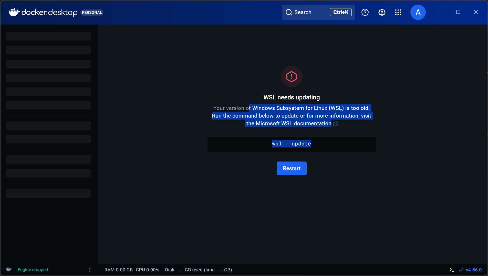
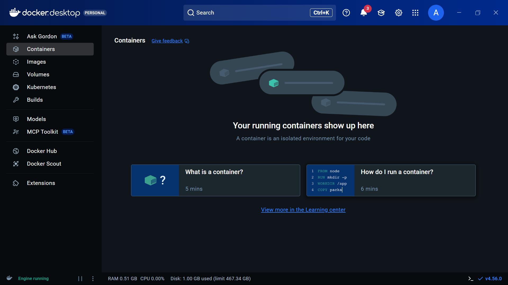

# Windows Docker Setup Guide

Step-by-step documentation of setting up Docker Desktop on Windows 11.

---

## Prerequisites

- Windows 11 Pro
- Admin access to your machine
- Stable internet connection

---

## Step 1: Download Docker Desktop

1. Go to: https://www.docker.com/products/docker-desktop/
2. Click **"Download Docker Desktop"**
3. Choose **AMD64** for standard Intel/AMD processors (ARM64 is for ARM chips only)


4. Run the installer: `Docker Desktop Installer.exe`

During installation:
- ✅ Check "Use WSL 2 instead of Hyper-V" (we'll change this later if needed)
- ✅ Check "Add shortcut to desktop"

---

## Step 2: WSL 2 vs Hyper-V (Understanding the Trade-offs)

Docker Desktop can use **two different backends**:

| Backend | Pros | Cons |
|---------|------|------|
| **WSL 2** | Faster, less RAM, better Linux compatibility | Can be difficult to install |
| **Hyper-V** | More reliable setup, built into Windows Pro | Uses more RAM, slightly slower |

### My Experience: WSL 2 Installation Failed

When first opening Docker Desktop, you may see this error:



### What I Tried (WSL 2 Route):

1. **Enable WSL features** in Admin PowerShell:
   ```powershell
   dism.exe /online /enable-feature /featurename:Microsoft-Windows-Subsystem-Linux /all /norestart
   dism.exe /online /enable-feature /featurename:VirtualMachinePlatform /all /norestart
   ```

2. **Restart computer**

3. **Install WSL kernel** from https://aka.ms/wsl2kernel

**But I got this error:**


The kernel installer kept saying "This update only applies to machines with Windows Subsystem for Linux" even though the features were enabled.

### The Solution: Use Hyper-V Instead

After multiple attempts with WSL 2, I switched to **Hyper-V backend**.

---

## Step 3: Enable Hyper-V (The Reliable Path)

1. Press `Win + R`, type `optionalfeatures`, press Enter
2. Check these boxes:
   - ✅ **Hyper-V** (expand and check all sub-items)
   - ✅ **Virtual Machine Platform**
   - ✅ **Windows Subsystem for Linux** (can leave checked, won't hurt)
3. Click OK
4. **Restart your computer**

---

## Step 4: Configure Docker to Use Hyper-V

1. Open **Docker Desktop**
2. Go to **Settings** (gear icon) → **General**
3. **UNCHECK** "Use the WSL 2 based engine"
4. Click **Apply & Restart**

Docker will now use Hyper-V instead of WSL 2.

---

## Step 5: Start the Privileged Helper Service

On first launch, you may see this:


Simply click **"Start service"** and allow admin access when prompted.

---

## Step 6: Docker is Running!

Once everything is set up, you'll see the main Docker Desktop interface:



**Indicators that Docker is working:**
- Bottom left shows: **"Engine running"**
- RAM and CPU stats are visible
- No error messages

---

## Step 7: Verify in Terminal

Open **Git Bash** and run:

```bash
docker --version
```

Then test with:

```bash
docker run hello-world
```

You should see a "Hello from Docker!" message.

---

## Troubleshooting Summary

| Error | Solution |
|-------|----------|
| "WSL is too old" | Try WSL 2 setup, or switch to Hyper-V |
| "WSL is not installed" | Enable features via `dism.exe` commands, restart |
| WSL kernel installer fails | Switch to Hyper-V backend |
| "Privileged helper service not running" | Click "Start service", allow admin access |
| Docker won't start | Ensure Hyper-V is enabled, restart computer |

---

## WSL 2 vs Hyper-V: When to Use Which

| Choose WSL 2 if... | Choose Hyper-V if... |
|--------------------|----------------------|
| Fresh Windows install | WSL 2 setup keeps failing |
| You need Linux tools alongside Docker | You just want Docker to work |
| You want better performance | You want reliable setup |
| You have time to troubleshoot | You need to get started quickly |

**For learning Docker/Zoomcamp:** Either backend works fine. The containers behave the same way.

---

## Notes

- Docker Desktop uses ~500MB-1GB of RAM when running
- Close Docker Desktop when not using it to free up resources
- You can always switch backends later in Docker Desktop settings
