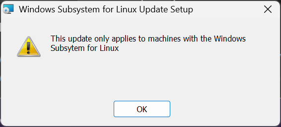

# Windows Docker Setup Guide

Step-by-step documentation of setting up Docker Desktop on Windows 11.

---

## Prerequisites

- Windows 11 Pro
- Admin access to your machine
- Stable internet connection

---

## Step 1: Download Docker Desktop

1. Go to: https://www.docker.com/products/docker-desktop/
2. Click **"Download Docker Desktop"**
3. Choose **AMD64** for standard Intel/AMD processors


4. Run the installer: `Docker Desktop Installer.exe`

During installation:
- ✅ Check "Use WSL 2 instead of Hyper-V"
- ✅ Check "Add shortcut to desktop"

---

## Step 2: Handle WSL Error

When you first open Docker Desktop, you may see this error:


**Don't panic!** This just means WSL needs to be set up.

---

## Step 3: Enable WSL Features

Open **PowerShell as Administrator** and run these commands:

**Enable WSL:**
```powershell
dism.exe /online /enable-feature /featurename:Microsoft-Windows-Subsystem-Linux /all /norestart
```

**Enable Virtual Machine Platform:**
```powershell
dism.exe /online /enable-feature /featurename:VirtualMachinePlatform /all /norestart
```

**⚠️ Restart your computer** after both commands complete.

---

## Step 4: Install WSL Kernel Update

After restart, download and run the kernel update: https://aka.ms/wsl2kernel

**Note:** If you try to install the kernel BEFORE enabling WSL features, you'll see this error:



Make sure Step 3 is complete and you've restarted before installing the kernel.

---

## Step 5: Set WSL 2 as Default

Open **Admin PowerShell** and run:

```powershell
wsl --set-default-version 2
```

---

## Step 6: Start Docker Desktop

1. Open Docker Desktop from Start menu
2. Wait for it to start (whale icon in system tray turns solid)
3. Verify in terminal:

```bash
docker --version
docker run hello-world
```

---

## Troubleshooting

| Error | Solution |
|-------|----------|
| "WSL is too old" | Run the dism.exe commands, restart |
| "WSL is not installed" | Enable WSL feature first (Step 3), restart |
| Kernel installer fails | Complete Step 3 and restart before installing kernel |
| Docker won't start | Ensure WSL 2 is default: `wsl --set-default-version 2` |

---

## Notes

- Docker Desktop uses ~500MB-1GB of RAM when running
- You don't need Ubuntu installed - Docker only needs the WSL kernel
- Install Ubuntu later if needed: `wsl --install -d Ubuntu`
